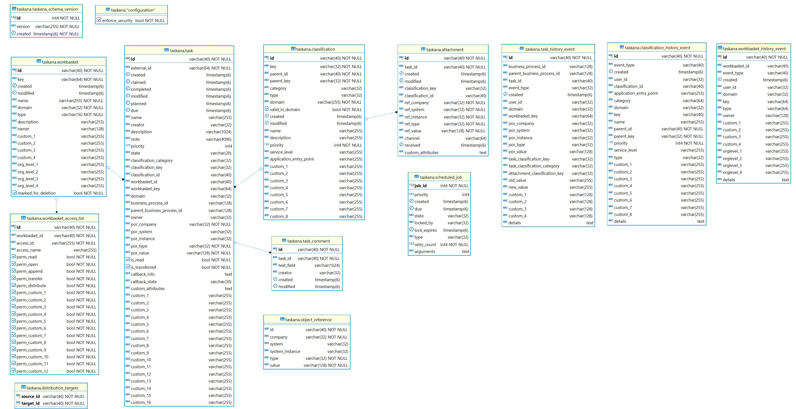

= Reference Guide

== table of contents

* <<Database Configuration>>
* <<TASKANA Configuration>>
** <<General Parameter>>
** <<Security Configuration>>
** <<Holidays>>
** <<Working time configuration>>
** <<History deletion upon task deletion>>
** <<History audit logger>>
** <<DMN Task router>>
** <<Validation of timestamps with a service level mismatch>>
** <<Additional User Info>>
* <<Job Configuration>>
** <<General Configuration>>
** <<Cleanup Job Configuration>>
** <<Task priority update Job Configuration>>
** <<User refresh Job Configuration>>
** <<Custom Jobs>>
* <<LDAP Configuration>>
* <<AdminUI Configuration>>
** <<REST API Configuration>>
** <<UI Customization>>
** <<How to serve configuration files>>
* <<Data Model>>
** <<Common>>
** <<TaskService>>
** <<TaskCommentService>>
** <<WorkbasketService>>
** <<ClassificationService>>
** <<JobService>>
** <<HistoryService>>
* <<Security Roles in TASKANA>>
* <<Workbasket Permissions>>
* <<API Documentation>>

== Database Configuration

Taskana uses a database to persist the managed entities.
When creating this database, you should consider the following items:

* We recommend to create the database with a page size of 32 k
* Be aware that the sort order of query results is governed by the collation sequence that is specified at database creation.
The default for the most databases is a case sensitive sort order.
If you want query results to be sorted case insensitively, you should specify an appropriate collation sequence.

For DB2, a database create command with case insensitive collation would be

```Sql
CREATE DATABASE <dbname> USING CODESET UTF-8 TERRITORY <territory> COLLATE USING 'CLDR181_LDE_AS_CX_EX_FX_HX_NX_S3' PAGESIZE 32 K <additional parameters>
```

The database schema can be changed by setting the parameter `taskana.schema` in the
`application.properties` file.
This applies to Spring environments, only.

Taskana connects to the database via a DataSource.
It does not support XADataSources for connections to databases.

== TASKANA Configuration

Taskana is configured via a configuration file `taskana.properties`.
This configuration file contains all parameters to control the behaviour of the taskana library.

=== General Parameter

|===
|Parameter |Description |Sample Value

|`taskana.domains`
|The pipe separated list of administrative domains
|DOMAIN_A, DOMAIN_B

|`taskana.classification.types`
|The pipe separated list of classification types
|TASK, DOCUMENT

|`taskana.classification.categories`
|The pipe separated list of classification categories
|EXTERNAL, MANUAL, AUTOMATIC, PROCESS

|`taskana.user.minimalPermissionsToAssignDomains`
|The list of minimal Workbasket permissions of a user needed to belong to the domain. Needed to
determine the domains of a user, which are aggregated in the getUser() method of the UserService.
Values have to match the Enum values of <<Workbasket Permissions>>. If this property is not
defined, the dynamic computation of the `domain` attribute will not be executed.

The permission READ always needs to be set, as it’s required for a user to see the Workbasket.
|READ, OPEN
|===

=== Security Configuration

The properties file contains the specification of the lists of access ids (i.e. users or groups) that belong to the roles user, business_admin or admin.

The keywords to specify these roles are as follows:

|===
|Parameter |Description |Sample Value

|`taskana.roles.user`
|The USER role grants access to Taskana. USER is everybody who gets assigned to and completes tasks.
|`cn=ksc-users,cn=groups,OU=Test,O=TASKANA \| teamlead-1 \| teamlead-2 \| user-1-1`

|`taskana.roles.business_admin`
|The BUSINESS_ADMINISTRATOR role allows to change the business configuration (workbaskets,
classifications, ...)
|`businessadmin \| cn=business-admins,cn=groups,OU=Test,O=TASKANA`

|`taskana.roles.admin`
|The ADMINISTRATOR role includes all permissions on the system.
|`admin \| uid=admin,cn=users,OU=Test,O=TASKANA`

|`taskana.roles.monitor`
|The MONITOR role grants access to all monitoring operations and to the monitoring UI.
|`monitor \| cn=monitor-users,cn=groups,OU=Test,O=TASKANA`

|`taskana.roles.task_admin`
|The TASK_ADMIN role includes all permissions on tasks with the exception of deleting a task/tasks.
It can also READ all workbaskets in case to create/transfer tasks in/to them.
|`task_admin`

|`taskana.roles.task_router`
|The TASK_ROUTER role is a technical role which allows creation of tasks in all workbaskets.
(Skips permission check during creation)
|`task_router`
|===

Each entry may contain a list of access ids that are separated by the '|' character.
Whitespace at the begin or end of each access id is ignored.

By default, this configuration file has the name 'taskana.properties' and is searched in the classpath.
In addition, the separator '|' is used.
Both defaults can be changed by specifying the property filename and separator explicitly when creating the TaskanaEngineConfiguration via constructor.

```Java
 TaskanaEngineConfiguration(DataSource dataSource, boolean useManagedTransactions,
        boolean securityEnabled, String propertiesFileName, String propertiesSeparator)
```

If in this call, either propertiesFileName or propertiesSeparator is null, Taskana uses the default value.

If for example, you want Taskana to use the 'application.properties' file from the classpath, you should specify "/application.properties" as propertiesFileName.

You may also specify a fully qualified filename that addresses a file directly.
In this case, that file is not searched on the classpath but loaded by its name.

Please note, that if you specify a non-default propertiesSeparator, the access ids must not contain any character that is contained in this propertiesSeparator.

If Taskana doesn't find a configuration file, it operates with empty roles.

=== Holidays

|===
|Parameter |Description |Sample Value

|`taskana.workingTime.holidays.german.enabled`
|When set to true, German public Holidays (like eastermonday) are enabled.
|`true`

|`taskana.workingTime.holidays.german.corpus-christi.enabled`
|When set to true, corpus christi is a public holiday too
|`true`

|`taskana.workingTime.holidays.custom`
|Allows to set dates as holiday. The format of an Holiday is in the format of `dd.MM` where `dd`
stand for day and `MM` stand for month. The single custom holidays have to be separated by either
by the default separator \|
|`31.07\|16.12`
|===

=== Working time configuration

Via the property `taskana.workingtime.schedule` you are able to specify the schedule of your working time.

[TIP]
If there is no such property, the default value of Taskana takes care that working day calculation happens as before (assuming your Timezone is Europe/Berlin).
This means there is no reconfiguration of Service Levels and similar things necessary.

* You can have multiple working slots per day separated by `|`

* The precision is up to you.
You can theoretically specify nanoseconds if you want to.
But typically minutes is the highest precision you will need.
The full format is documented by
https://docs.oracle.com/javase/8/docs/api/java/time/LocalTime.html#parse-java.lang.CharSequence-[LocalTime of the Java SDK]

|===
|Paramter |Description |Sample Value

|`taskana.workingtime.schedule.monday`
|Defines the working hours for monday.
|`07:00-12:00\|13:00-18:00`

|`taskana.workingtime.schedule.tuesday`
|Defines the working hours for tuesday.
|`07:00-12:00\|13:00-18:00`

|`taskana.workingtime.schedule.wednesday`
|Defines the working hours for wednesday.
|`07:00-12:00\|13:00-18:00`

|`taskana.workingtime.schedule.thursday`
|Defines the working hours for thursday.
|`07:00-12:00\|13:00-18:00`

|`taskana.workingtime.schedule.friday`
|Defines the working hours for friday.
|`07:00-12:00\|13:00-18:00`

|`taskana.workingtime.schedule.saturday`
|Defines the working hours for saturday.
|`07:00-12:00`

|`taskana.workingtime.schedule.sunday`
|Defines the working hours for sunday.
|`13:00-18:00`

|`taskana.workingtime.timezone`
|specify the time zone that is used in to calculate working time. The format of the possible values
is documented by https://docs.oracle.com/javase/8/docs/api/java/time/ZoneId.html#of-java.lang.String-[ZoneId of the Java SDK].
We generally recommend to use region Ids.

The default value is `Europe/Berlin`.
|`America/Phoenix`
|===

=== History deletion upon task deletion

By adding the property `taskana.history.simple.deleteOnTaskDeletion.enabled` to the `taskana.properties`
file the history deletion upon task deletion can be activated.
If activated all history events concerning the deleted task/s will also be deleted

=== History audit logger

By adding the property `taskana.history.logger.name` it is possible to configure the name of the logger which you want to use to write to your audit file.
Furthermore you can configure the audit logger through a custom log4j.xml file.

Example

```
taskana.historylogger.name=AUDIT
```

=== DMN Task router

The location of the DMN file which you would like to use for routing rules is configurable.
The Router will first check if a file exists in the filesystem for the provided value and if that's not the case it will check the classpath.
You have to specify the location/path by adding the
`taskana.routing.dmn` property.

Example

```
taskana.routing.dmn=/dmn-routing.dmn
```

=== Validation of timestamps with a service level mismatch

The `taskana.servicelevel.validation.enforce` allows the user to create tasks with timestamps that do not match i.e. exceed the service level of the classification.
If the property is set to `true`, the planned and due timestamp of a Task can be set to points in time, which are further apart than the service level of the classification would normally allow.

=== Additional User Info

If you are using the USER_INFO table you can add the Full/Long name when retrieveing Tasks/TaskComments/TaskHistoryEvents with the property `taskana.user.addAdditionalUserInfo`

== Job Configuration

=== General Configuration

|===
|Parameter |Description |Sample Value

|`taskana.jobs.scheduler.enabled`
|enable or disable the jobscheduler at all. if you want to run your jobs, set it to true.
|`true`

|`taskana.jobs.scheduler.initialStartDelay`
|wait time before the first job run in milliseconds.
|`10000`

|`taskana.jobs.scheduler.period`
|sleeping time before the next job runs
|`12`

|`taskana.jobs.scheduler.periodTimeUnit`
|timeunit for the sleeping period

Possible values: MILLISECONDS, SECONDS, MINUTES, HOURS, DAYS
|`HOURS`

|`taskana.jobs.maxRetries`
|The maximum number of automatic retries if the job fails
|`3`

|`taskana.jobs.batchSize`
|The maximum number of task to be processed in one job
|`20`
|===

=== Cleanup Job Configuration

|===
|Parameter |Description |Sample Value

|`taskana.jobs.cleanup.task.enable`
|Should the CleanUp Job run at all?
|`true`

|`taskana.jobs.cleanup.task.minimumAge`
|The minimum time between the completion of the task and the deletion by the cleanup

(Duration in ISO 8601 format)
|`P14D`

|`taskana.jobs.cleanup.task.allCompletedSameParentBusiness`
|Wait until all tasks with the same parent business process ID are in an end state
before cleaning up tasks.
|`true`

|`taskana.jobs.cleanup.workbasket.enable`
|Should the workbasket cleanup job run at all?
|`true`

|`taskana.jobs.cleanup.history.simple.enable`
|Should the SimpleHistory cleanup job run at all?
|`true`

|`taskana.jobs.cleanup.history.simple.batchSize`
|Number of elements which are processed by one Job Run
|`20`

|`taskana.jobs.cleanup.history.simple.minimumAge`
|The minimum time between the completion of the task and the deletion by the cleanup

(Duration in ISO 8601 format)
|`P14D`

|`taskana.jobs.cleanup.history.simple.allCompletedSameParentBusiness`
|Wait until all tasks (referenced by history events) with the same parent business process ID
are in an end state before cleaning up history events.
|`true`
|===

=== Task priority update Job Configuration

|===
|Parameter |Description |Sample Value

|`taskana.jobs.priority.task.enable`
|Should the priorityUpdate Job run at all?
|`true`

|`taskana.jobs.priority.task.batchSize`
|The maximum number of tasks to be processed in one job.
|`20`

|`taskana.jobs.priority.task.firstRunAt`
|First start of the job.

(DateTime in ISO 8601 format)
|`2018-07-25T08:00:00Z`

|`taskana.jobs.priority.task.runEvery`
|Cycle time for the cleanup job to run

(Duration in ISO 8601 format)
|`P1D`
|===

=== User refresh Job Configuration

|===
|Parameter |Description |Sample Value

|`taskana.jobs.refresh.user.enable`
|Should the Refresh Job run at all?
|`true`

|`taskana.jobs.refresh.user.firstRunAt`
|First start of the job.

(DateTime in ISO 8601 format)
|`2018-07-25T22:00:00Z`

|`taskana.jobs.refresh.user.runEvery`
|Cycle time for the refresh job to run

(Duration in ISO 8601 format)
|`P1D`
|===

=== Custom Jobs

To run Custom Jobs use the property `taskana.jobs.customJobs` and specify the fully qualified class name here.

Example

```
taskana.jobs.customJobs=de.bespiel.NewJob|com.github.ExistingCustomJob
```

== LDAP Configuration

TASKANA uses a number of properties to enable the out-of-the-box integration with a LDAP server.
These properties are described here.

As the LDAP integration is part of the REST API, which is based on Spring, the LDAP properties have to be placed in the `application.properties` file, *not* in the `taskana.properties`.

|===
|Parameter |Description |Sample Value |Optional?

|`taskana.ldap.serverUrl`
|
|`ldap://localhost:10389`
|false

|`taskana.ldap.bindDn`
|
|`uid=admin`
|false

|`taskana.ldap.bindPassword`
|
|`secret_password`
|false

|`taskana.ldap.baseDn`
|
|`ou=Test,O=TASKANA`
|false

|`taskana.ldap.userSearchBase`
|
|`cn=users`
|false

|`taskana.ldap.userSearchFilterName`
|
|`objectclass`
|false

|`taskana.ldap.userSearchFilterValue`
|
|`person`
|false

|`taskana.ldap.userFirstnameAttribute`
|
|`givenName`
|false

|`taskana.ldap.userLastnameAttribute`
|
|`sn`
|false

|`taskana.ldap.userFullnameAttribute`
|
|`cn`
|false

|`taskana.ldap.userPhoneAttribute`
|
|`phoneNumber`
|true

|`taskana.ldap.userMobilePhoneAttribute`
|
|`mobileNumber`
|true

|`taskana.ldap.userEmailAttribute`
|
|`email`
|true

|`taskana.ldap.userOrglevel1Attribute`
|
|`orgLevel1`
|true

|`taskana.ldap.userOrglevel2Attribute`
|
|`orgLevel2`
|true

|`taskana.ldap.userOrglevel3Attribute`
|
|`orgLevel3`
|true

|`taskana.ldap.userOrglevel4Attribute`
|
|`orgLevel4`
|true

|`taskana.ldap.userIdAttribute`
|
|`uid`
|false

|`taskana.ldap.userMemberOfGroupAttribute`
|
|`memberOf`
|false

|`taskana.ldap.groupSearchBase`
|
|`cn=groups`
|false

|`taskana.ldap.groupSearchFilterName`
|
|`objectclass`
|false

|`taskana.ldap.groupSearchFilterValue`
|
|`groupOfUniqueNames`
|false

|`taskana.ldap.groupNameAttribute`
|
|`cn`
|false

|`taskana.ldap.minSearchForLength`
|
|`3`
|true

|`taskana.ldap.maxNumberOfReturnedAccessIds`
|
|`50`
|true

|`taskana.ldap.groupsOfUser`
|*deprecated*

Please use `taskana.ldap.groupsOfUser.name` instead.
|`uniquemember`
|true

|`taskana.ldap.groupsOfUser.name`
|Name of the attribute in a group object, which specifies the member of the group.
|`uniquemember`
|true

|`taskana.ldap.groupsOfUser.type`
|Type of the attribute in a group object, which specifies the member of the group.

If you specify ‘dn’ as the type, TASKANA assumes that this field contains exactly the full dn of
the member.
|`dn`
|true
|===

== AdminUI Configuration

=== REST API Configuration

The REST Endpoint for the Frontend application can be configured using a JSON file.
That JSON file has to be served at `/environments/data-sources/environment-information.json` and will be loaded *on initial request*.

The `environment-information.json` contains two configurations:

|===
|Parameter |Description |Sample Value

|`taskanaRestUrl`
|The root path of the REST Service. Please note that you have append  `/api` . Otherwise the
Frontend application will not find the REST Service.
|`http://localhost:8080/taskana/api`

|`taskanaLogoutUrl`
|The location a user is redirected to when a logout is triggered.
|`http://localhost:8080/taskana/logout`
|===

The default https://github.com/Taskana/taskana/blob/master/web/src/environments/data-sources/environment-information.json[environment-information.json]
file can be found in our GitHub repository.

=== UI Customization

Some TASKANA UI elements, such as custom properties, can be configured using a JSON file.
That json file has to be served at `/environments/data-sources/taskana-customization.json` and will be loaded
*on initial request*.

The default https://github.com/Taskana/taskana/blob/master/web/src/environments/data-sources/taskana-customization.json[taskana-customization.json]
will be found in our GitHub repository.

If you have any questions regarding the UI Customization, please don’t hesitate to contact us.

=== How to serve configuration files

There are multiple ways to serve these configuration files.
Our example project showcases two:

. Using the `/static` folder in order to serve a static file.

. Using a REST Controller in order to serve a static file.

Our example project serves the `environment-information.json` using the `/static` folder.
Here is a link to the repository: https://github.com/Taskana/taskana/tree/master/rest/taskana-rest-spring-example-common/src/main/resources/static/environments/data-sources

In our example the `taskana-customization.json` is served via a https://github.com/Taskana/taskana/blob/master/rest/taskana-rest-spring-example-common/src/main/java/pro/taskana/example/rest/controllers/ResourcesController.java[REST Controller].
This allows further customization.
E.g. Based on some environment properties you can serve a different
`taskana-customization.json`.
This can be done programmatically within the REST Controller.

== Data Model



=== Common

==== TASKANA_SCHEMA_VERSION

|===
|Column Name |Type |Description |Example Value

|`ID`
|CHAR(40)
|Unique ID
|

|`VERSION`
|VARCHAR(255)
|The version of the TASKANA schema
|`5.10.0`
|===

==== CONFIGURATION

|===
|Column Name |Type |Description |Example Value

|`ENFORCE_SECURITY`
|BOOLEAN
|Flag to determine if security is enforced for TASKANA
|`true`
|===

=== TaskService

==== TASK

|===
|Column Name |Type |Description |Example Value

|`ID`
|CHAR(40)
|Unique ID
|

|`EXTERNAL_ID`
|VARCHAR(64)
|Id to correlate the task to a task in an external system.
|

|`CREATED`
|TIMESTAMP
|The creation timestamp of the task in the system.
|`2017-12-01 13:39:20`

|`CLAIMED`
|TIMESTAMP
|The timestamp of the last claim-operation on the task
|

|`COMPLETED`
|TIMESTAMP
|The timestamp of the completion of the task
|

|`MODIFIED`
|TIMESTAMP
|Timestamp of the last modification of the task
|

|`PLANNED`
|TIMESTAMP
|Planned start of the task.

The actual completion of the task should be between PLANNED and DUE.
|

|`DUE`
|TIMESTAMP
|Timestamp when the task is due.
The actual completion of the task should be between PLANNED and DUE.
|

|`NAME`
|VARCHAR(255)
|The name of the task
|`Inspect application`

|`CREATOR`
|VARCHAR(32)
|
|

|`DESCRIPTION`
|VARCHAR(1024)
|The description of the task
|

|`NOTE`
|VARCHAR(4096)
|
|

|`PRIORITY`
|INT
|The priority of the task
|

|`STATE`
|VARCHAR(20)
|The state of the task. See (...)
|

|`CLASSIFICATION_CATEGORY`
|VARCHAR(32)
|The category of the classification of the task
|

|`CLASSIFICATION_KEY`
|VARCHAR(32)
|The classified type of the task. Reference the classifications in the ClassificationService.
|`Approval`

|`CLASSIFICATION_ID`
|VARCHAR(40)
|The id of the classification of the task
|

|`WORKBASKET_ID`
|VARCHAR(40)
|The id of the workbasket the task is attached to
|

|`WORKBASKET_KEY`
|VARCHAR(32)
|The workbasket key of the workbasket, the tasks resides in.
|`CLAIM_INBOUND`

|`DOMAIN`
|VARCHAR(32)
|The current domain of the task (derived from the workbasket)
|`DOMAIN_A`

|`BUSINESS_PROCESS_ID`
|VARCHAR(128)
|The id of the business process the task belongs to
|

|`PARENT_BUSINESS_PROCESS_ID`
|VARCHAR(128)
|The id of the parent business process the task belongs to
|

|`OWNER`
|VARCHAR(32)
|The owner of the tasks. The owner is set upon claiming of the task.
|

|`POR_COMPANY`
|VARCHAR(32)
|The company referenced primary object belongs to.
|`ABC`

|`POR_SYSTEM`
|VARCHAR(32)
|The (kind of) system, the object resides in (e.g. SAP, MySystem A, ...)
|`ERP`

|`POR_INSTANCE`
|VARCHAR(32)
|The instance of the system, the object resides in.
|`33`

|`POR_TYPE`
|VARCHAR(32)
|The type of the reference (contract, claim, policy, customer, ...)
|`VNR`

|`POR_VALUE`
|VARCHAR(128)
|The value of the primary object reference
|`1234567`

|`IS_READ`
|BOOLEAN
|Indicator if the task has been read
|

|`IS_TRANSFERRED`
|BOOLEAN
|Indicator if the task has been transferred
|

|`CALLBACK_INFO`
|CLOB
|Callback information for usage with an adapter
|

|`CALLBACK_STATE`
|VARCHAR(30)
|Signals an adapter if a callback to an external system is necessary
|

|`CUSTOM_ATTRIBUTES`
|CLOB
|A container for all additional information on the task in JSON representation
|

|`CUSTOM_1`
|VARCHAR(255)
|A custom property with name "1"
|

|`CUSTOM_2`
|VARCHAR(255)
|A custom property with name "2"
|

|`CUSTOM_3`
|VARCHAR(255)
|A custom property with name "3"
|

|`CUSTOM_4`
|VARCHAR(255)
|A custom property with name "4"
|

|`CUSTOM_5`
|VARCHAR(255)
|A custom property with name "5"
|

|`CUSTOM_6`
|VARCHAR(255)
|A custom property with name "6"
|

|`CUSTOM_7`
|VARCHAR(255)
|A custom property with name "7"
|

|`CUSTOM_8`
|VARCHAR(255)
|A custom property with name "8"
|

|`CUSTOM_9`
|VARCHAR(255)
|A custom property with name "9"
|

|`CUSTOM_10`
|VARCHAR(255)
|A custom property with name "10"
|

|`CUSTOM_11`
|VARCHAR(255)
|A custom property with name "11"
|

|`CUSTOM_12`
|VARCHAR(255)
|A custom property with name "12"
|

|`CUSTOM_13`
|VARCHAR(255)
|A custom property with name "13"
|

|`CUSTOM_14`
|VARCHAR(255)
|A custom property with name "14"
|

|`CUSTOM_15`
|VARCHAR(255)
|A custom property with name "15"
|

|`CUSTOM_16`
|VARCHAR(255)
|A custom property with name "16"
|
|===

==== OBJECT_REFERENCE

|===
|Column Name |Type |Description |Example Value

|`ID`
|CHAR(40)
|Unique ID
|

|`COMPANY`
|VARCHAR(32)
|The name of the company the referenced business object belongs to
|`ABC`

|`SYSTEM`
|VARCHAR(32)
|The name of the system containing the object
|`XYZ_CLAIM_SYSTEM`

|`SYSTEM_INSTANCE`
|VARCHAR(32)
|The instance of the system (to distinguish between multiple installations of the same system
|`33`

|`TYPE`
|VARCHAR(32)
|The type of the referenced business object
|`CLAIM`

|`VALUE`
|VARCHAR(128)
|The id of the referenced business object
|`1234567`
|===

==== ATTACHMENT

|===
|Column Name |Type |Description |Example Value

|`ID`
|CHAR(40)
|Unique ID
|

|`TASK_ID`
|CHAR(40)
|The task the attachment belongs to
|

|`CREATED`
|TIMESTAMP
|
|

|`MODIFIED`
|TIMESTAMP
|
|

|`CLASSIFICATION_KEY`
|VARCHAR(32)
|The classification of the attachment (if applicable)
|

|`CLASSIFICATION_ID`
|VARCHAR(40)
|The classification id of the attachment
|

|`REF_COMPANY`
|VARCHAR(32)
|The company referenced object belongs to.
|

|`REF_SYSTEM`
|VARCHAR(32)
|The (kind of) system, the object resides in (e.g. DMS, Archive, ...)
|

|`REF_INSTANCE`
|VARCHAR(32)
|The instance of the system, the object resides in.
|

|`REF_TYPE`
|VARCHAR(32)
|The type of the reference (Archived Document, ...)
|

|`REF_VALUE`
|VARCHAR(128)
|The value of the primary object reference
|

|`CHANNEL`
|VARCHAR(64)
|The channel through which the attachment has been received
|

|`RECEIVED`
|TIMESTAMP
|The timestamp on which the attachment has been received. This must not match the creation
timestamp if for example a physical document is received on Friday but entered in the system on
Monday.
|

|`CUSTOM_ATTRIBUTES`
|CLOB
|A container for all additional information on the attachment in JSON representation
|
|===

=== TaskCommentService

==== TASK_COMMENT

|===
|Column Name |Type |Description |Example Value

|`ID`
|CHAR(40)
|Unique ID
|`TCI:000000000000000000000000000000000000`

|`TASK_ID`
|VARCHAR(40)
|The task the task comment belongs to
|`TKI:000000000000000000000000000000000000`

|`TEXT_FIELD`
|VARCHAR(1024)
|The actual comment
|`This task is nice`

|`CREATOR`
|VARCHAR(32)
|The creator of the task comment
|`John Doe`

|`CREATED`
|TIMESTAMP
|The creation timestamp of the task comment in the system.
|`2020-12-01 13:39:20`

|``
|TIMESTAMP
|Timestamp of the last modification of the task comment
|`2020-15-01 15:24:20`
|===

=== WorkbasketService

==== WORKBASKET

|===
|Column Name |Type |Description |Example Value

|`ID`
|CHAR(40)
|Unique ID
|

|`KEY`
|VARCHAR(64)
|They key of the workbasket
|

|`CREATED`
|TIMESTAMP
|The creation timestamp of the workbasket in the system.
|`2017-12-01 13:39:20`

|`MODIFIED`
|TIMESTAMP
|Timestamp of the last modification of the workbasket
|

|`NAME`
|VARCHAR(255)
|The name of the workbasket
|

|`DOMAIN`
|VARCHAR(32)
|The domain in which the workbasket is visible
|

|`TYPE`
|VARCHAR(16)
|The type of the workbasket
|

|`DESCRIPTION`
|VARCHAR(255)
|The description of the workbasket
|

|`OWNER`
|VARCHAR(32)
|The owner of the workbasket. The owner is responsible for the on-time completion of all tasks in
the workbasket.
|

|`ORG_LEVEL_1`
|VARCHAR(255)
|The first Org Level (the top one)

The Org Level is an association with an org hierarchie level in the organization. The values are
used for monitoring and statistical purposes and should reflect the responsibility of the tasks in
the workbasket.
|

|`ORG_LEVEL_2`
|VARCHAR(255)
|The second Org Level
|

|`ORG_LEVEL_3`
|VARCHAR(255)
|The third Org Level
|

|`ORG_LEVEL_4`
|VARCHAR(255)
|The fourth Org Level (the lowest one).
|

|`CUSTOM_1`
|VARCHAR(255)
|A custom property with name "1"
|

|`CUSTOM_2`
|VARCHAR(255)
|A custom property with name "2"
|

|`CUSTOM_3`
|VARCHAR(255)
|A custom property with name "3"
|

|`CUSTOM_4`
|VARCHAR(255)
|A custom property with name "4"
|

|`MARKED_FOR_DELETION`
|BOOLEAN
|Indicator if the workbasket is marked for deletion
|
|===

==== WORKBASKET_ACCESS_LIST

|===
|Column Name |Type |Description |Example Value

|`ID`
|CHAR(40)
|Unique ID
|

|`WORKBASKET_ID`
|CHAR(40)
|The workbasket
|

|`ACCESS_ID`
|VARCHAR(255)
|The access id, this ACL entry refers to. This could be either a userid or a full qualified group
id (both lower case)
|

|`ACCESS_NAME`
|VARCHAR(255)
|the name of the group or user for which the WorkbasketAccessItem controls access permissions
|

|`PERM_READ`
|BOOLEAN
|The permission to read the information about the workbasket
|

|`PERM_OPEN`
|BOOLEAN
|The permission to view the content (the tasks) of a workbasket
|

|`PERM_APPEND`
|BOOLEAN
|The permission to add tasks to the workbasket (required for creation and tranferring of tasks)
|

|`PERM_TRANSFER`
|BOOLEAN
|The permission to transfer tasks (out of the current workbasket)
|

|`PERM_DISTRIBUTE`
|BOOLEAN
|The permission to distribute tasks from the workbasket
|

|`PERM_CUSTOM_1`
|BOOLEAN
|The permission for a custom property with name "1"
|

|`PERM_CUSTOM_2`
|BOOLEAN
|The permission for a custom property with name "2"
|

|`PERM_CUSTOM_3`
|BOOLEAN
|The permission for a custom property with name "3"
|

|`PERM_CUSTOM_4`
|BOOLEAN
|The permission for a custom property with name "4"
|

|`PERM_CUSTOM_5`
|BOOLEAN
|The permission for a custom property with name "5"
|

|`PERM_CUSTOM_6`
|BOOLEAN
|The permission for a custom property with name "6"
|

|`PERM_CUSTOM_7`
|BOOLEAN
|The permission for a custom property with name "7"
|

|`PERM_CUSTOM_8`
|BOOLEAN
|The permission for a custom property with name "8"
|

|`PERM_CUSTOM_9`
|BOOLEAN
|The permission for a custom property with name "9"
|

|`PERM_CUSTOM_10`
|BOOLEAN
|The permission for a custom property with name "10"
|

|`PERM_CUSTOM_11`
|BOOLEAN
|The permission for a custom property with name "11"
|

|`PERM_CUSTOM_12`
|BOOLEAN
|The permission for a custom property with name "12"
|
|===

==== DISTRIBUTION_TARGETS

|===
|Column Name |Type |Description |Example Value

|`SOURCE_ID`
|CHAR(40)
|The workbasket ID of the workbasket which serves as source for the distribution
|

|`TARGET_ID`
|CHAR(40)
|The workbasket ID of the workbasket which serves as target for the distribution
|
|===

=== ClassificationService

==== CLASSIFICATION

|===
|Column Name |Type |Description |Example Value

|`ID`
|CHAR(40)
|Unique ID
|`CLI:000000000000000000000000000000000001`

|`KEY`
|VARCHAR(32)
|The key of the classification. This is typically an externally known code or abbreviation of the
classification
|`SD110`

|`PARENT_ID`
|VARCHAR(40)
|The id of the parent classification. Empty string ("") if this is a root classification.
|`CLI:000000000000000000000000000000000001`

|`PARENT_KEY`
|VARCHAR(32)
|The key of the parent classification. Empty string ("") if this is a root classification.
|`SD110`

|`CATEGORY`
|VARCHAR(32)
|The category of the classification (MANUAL, EXTERNAL, AUTOMATIC, PROCESS)
|`MANUAL`

|`TYPE`
|VARCHAR(32)
|The type of classification (TASK, DOCUMENT)
|`DOCUMENT`

|`DOMAIN`
|VARCHAR(255)
|The domain for which this classification is specified.
|

|`VALID_IN_DOMAIN`
|BOOLEAN
|True, if this classification to objects in this domain.
|

|`CREATED`
|TIMESTAMP
|The creation timestamp of the classification in the system.
|`2017-12-01 13:39:20`

|`MODIFIED`
|TIMESTAMP
|Timestamp of the last modification of the classification
|

|`NAME`
|VARCHAR(255)
|The name of the classification
|

|`DESCRIPTION`
|VARCHAR(255)
|The description of the classification
|

|`PRIORITY`
|INT
|The priority of the classification
|`5`

|`SERVICE_LEVEL`
|VARCHAR(32)
|The service level of the classification. This is stated according to ISO 8601
|`P5D`

|`APPLICATION_ENTRY_POINT`
|VARCHAR(255)
|The logical name of the entry point, the task list application should redirect to work on a task
of this classification.
|`portal::customerDetails`

|`CUSTOM_1`
|VARCHAR(255)
|A custom property with name "1"
|

|`CUSTOM_2`
|VARCHAR(255)
|A custom property with name "2"
|

|`CUSTOM_3`
|VARCHAR(255)
|A custom property with name "3"
|

|`CUSTOM_4`
|VARCHAR(255)
|A custom property with name "4"
|

|`CUSTOM_5`
|VARCHAR(255)
|A custom property with name "5"
|

|`CUSTOM_6`
|VARCHAR(255)
|A custom property with name "6"
|

|`CUSTOM_7`
|VARCHAR(255)
|A custom property with name "7"
|

|`CUSTOM_8`
|VARCHAR(255)
|A custom property with name "8"
|
|===

=== JobService

==== SCHEDULED_JOB

|===
|Column Name |Type |Description |Example Value

|`JOB_ID`
|INT(4)
|Unique ID
|

|`PRIORITY`
|INT(4)
|The priority of the job
|

|`CREATED`
|TIMESTAMP
|The creation timestamp of the job in the system.
|`2017-12-01 13:39:20`

|`DUE`
|TIMESTAMP
|Timestamp when the job is due.
|

|`STATE`
|VARCHAR(32)
|The state of the job
|`READY`

|`LOCKED_BY`
|VARCHAR(32)
|The name of the current thread that is working on the job
|

|`LOCK_EXPIRES`
|TIMESTAMP
|Timestamp when the lock on the job will expire
|

|`TYPE`
|VARCHAR(32)
|The type of the job
|`TASKCLEANUPJOB`

|`RETRY_COUNT`
|INT(4)
|Amount of retries in case when something goes wrong
|`3`

|`ARGUMENTS`
|TEXT
|
|
|===

=== HistoryService

==== TASK_HISTORY_EVENTS

|===
|Column Name |Type |Description |Example Value

|`ID`
|CHAR(40)
|Unique ID
|

|`BUSINESS_PROCESS_ID`
|VARCHAR(128)
|
|

|`PARENT_BUSINESS_PROCESS_ID`
|VARCHAR(128)
|
|

|`TASK_ID`
|CHAR(40)
|
|

|`EVENT_TYPE`
|VARCHAR(32)
|The type of the event.
|`CREATED`

|`CREATED`
|TIMESTAMP
|The timestamp of the event.
|`2017-12-01 13:39:20`

|`USER_ID`
|VARCHAR(32)
|The userid of the user who triggered this event.
|`user_1_1`

|`DOMAIN`
|VARCHAR(32)
|The domain for which this classification is specified.
|

|`WORKBASKET_KEY`
|VARCHAR(64)
|The workbasket key of the workbasket, the tasks resides in.
|

|`POR_COMPANY`
|VARCHAR(32)
|The company referenced primary object belongs to.
|`ABC`

|`POR_SYSTEM`
|VARCHAR(32)
|The (kind of) system, the object resides in (e.g. SAP, MySystem A, ...)
|`ERP`

|`POR_INSTANCE`
|VARCHAR(32)
|The instance of the system, the object resides in.
|`33`

|`POR_TYPE`
|VARCHAR(32)
|The type of the reference (contract, claim, policy, customer, ...)
|`VNR`

|`POR_VALUE`
|VARCHAR(128)
|The value of the primary object reference
|`1234567`

|`TASK_CLASSIFICATION_KEY`
|VARCHAR(32)
|True, if this classification to objects in this domain.
|

|`TASK_CLASSIFICATION_CATEGORY`
|VARCHAR(32)
|The category of the task classification
|

|`ATTACHMENT_CLASSIFICATION_KEY`
|VARCHAR(32)
|The creation timestamp of the workbasket in the system.
|

|`OLD_VALUE`
|VARCHAR(255)
|The old value before the event occured.
|

|`NEW_VALUE`
|VARCHAR(255)
|The new (changed) value after the event occured.
|

|`CUSTOM_1`
|VARCHAR(128)
|A custom property with name "1", for individual usage
|

|`CUSTOM_2`
|VARCHAR(128)
|A custom property with name "2", for individual usage
|

|`CUSTOM_3`
|VARCHAR(128)
|A custom property with name "3", for individual usage
|

|`CUSTOM_4`
|VARCHAR(128)
|A custom property with name "4", for individual usage
|

|`DETAILS`
|CLOB
|The details of the changes within the event's task that occured
|
|===

==== CLASSIFICATION_HISTORY_EVENTS

|===
|Column Name |Type |Description |Example Value

|`ID`
|CHAR(40)
|Unique ID
|`12345`

|`EVENT_TYPE`
|VARCHAR(32)
|The type of the event
|`UPDATED`

|`CREATED`
|TIMESTAMP
|The timestamp of the event.
|`2017-12-01 13:39:20`

|`USER_ID`
|VARCHAR(32)
|The userid of the user who triggered this event.
|

|`CLASSIFICATION_ID`
|VARCHAR(32)
|The id of the event's classification.
|

|`APPLICATION_ENTRY_POINT`
|VARCHAR(64)
|The logical name of the entry point, the task list application should redirect to work on a task
of this event's classification.
|

|`CATEGORY`
|VARCHAR(32)
|The category of the event's classification
|`MANUAL`

|`DOMAIN`
|VARCHAR(32)
|The domain for which this event's classification is specified.
|

|`KEY`
|VARCHAR(32)
|The key of the event's classification. This is typically an externally known code or abbreviation
of the classification
|

|`NAME`
|VARCHAR(32)
|The name of the events classification
|

|`PARENT_ID`
|VARCHAR(128)
|The id of the event's parent classification.
|

|`PARENT_KEY`
|VARCHAR(32)
|The key of the event's parent classification.
|

|`PRIORITY`
|VARCHAR(32)
|The priority of the event's classification
|

|`SERVICE_LEVEL`
|VARCHAR(32)
|The service level of the event's classification.
|

|`TYPE`
|VARCHAR(255)
|The type of the event's classification
|`TASK`

|`CUSTOM_1`
|VARCHAR(255)
|A custom property with name "1", for individual usage
|`123`

|`CUSTOM_2`
|VARCHAR(255)
|A custom property with name "2", for individual usage
|`XYZ`

|`CUSTOM_3`
|VARCHAR(255)
|A custom property with name "3", for individual usage
|

|`CUSTOM_4`
|VARCHAR(255)
|A custom property with name "4", for individual usage
|

|`CUSTOM_5`
|VARCHAR(255)
|A custom property with name "5", for individual usage
|

|`CUSTOM_6`
|VARCHAR(255)
|A custom property with name "6", for individual usage
|

|`CUSTOM_7`
|VARCHAR(255)
|A custom property with name "7", for individual usage
|

|`CUSTOM_8`
|VARCHAR(255)
|A custom property with name "8", for individual usage
|

|`DETAILS`
|CLOB
|The details of the changes within the event's classification that occured
|
|===

==== WORKBASKET_HISTORY_EVENTS

|===
|Column Name |Type |Description |Example Value

|`ID`
|CHAR(40)
|Unique ID
|`12345`

|`WORKBASKET_ID`
|VARCHAR(128)
|The id of the event's workbasket
|

|`EVENT_TYPE`
|VARCHAR(32)
|The type of the event
|`DELETED`

|`CREATED`
|TIMESTAMP
|The timestamp of the event.
|`2017-12-01 13:39:20`

|`USER_ID`
|VARCHAR(32)
|The userid of the user who triggered this event.
|

|`DOMAIN`
|VARCHAR(32)
|The domain for which this workbasket is specified.
|

|`KEY`
|VARCHAR(64)
|The key of the event's workbasket
|

|`TYPE`
|VARCHAR(32)
|The type of the event's workbasket
|

|`OWNER`
|VARCHAR(32)
|The owner of the event's workbasket.
|

|`CUSTOM_1`
|VARCHAR(255)
|A custom property with name "1", for individual usage
|

|`CUSTOM_2`
|VARCHAR(255)
|A custom property with name "2", for individual usage
|

|`CUSTOM_3`
|VARCHAR(255)
|A custom property with name "3", for individual usage
|

|`CUSTOM_4`
|VARCHAR(255)
|A custom property with name "4", for individual usage
|

|`ORGLEVEL_1`
|VARCHAR(255)
|The event's workbasket first (top) orgLevel
|

|`ORGLEVEL_2`
|VARCHAR(255)
|The event's workbasket second orgLevel
|

|`ORGLEVEL_3`
|VARCHAR(255)
|The event's workbasket third orgLevel
|

|`ORGLEVEL_4`
|VARCHAR(255)
|The event's workbasket fourth (top) orgLevel
|

|`DETAILS`
|CLOB
|The details of the changes within the event's workbasket that occured
|
|===

== Security Roles in TASKANA

Taskana distinguishes between five different roles:

* USER
+
The USER role grants access to Taskana. USER is everybody who gets assigned to and completes tasks.
* TASK_ADMIN
+
The TASK_ADMIN role includes all permissions on tasks with the exception of deleting a task/tasks.
It can also READ all workbaskets in case to create/transfer tasks in/to them.
* BUSINESS_ADMINISTRATOR
+
The BUSINESS_ADMINISTRATOR role allows to change the business configuration (workbaskets,
classifications, ...)
* ADMINISTRATOR
+
The ADMINISTRATOR role includes all permissions on the system.
* MONITOR
+
The MONITOR role grants access to all monitoring operations and to the monitoring UI.

Since Taskana is based on JAAS, it provides a basic role mapping for Principals to roles. This
is configured in the TaskanaEngineConfiguration. You can assign a list of Principal names to each
role. Taskana will check if one of the user principals is contained in the required role.

== Workbasket Permissions

Taskana allows for a fine grained access control to Workbaskets. This is done by maintaining an access control list for each Workbasket. An access control list item grants a set of permissions to an access id (JAAS principial, user or group).

The following permissions are available:


|===
|Permission|Meaning

|READ
|Read or query Workbasket metadata and its containing Tasks.

If a user does *not* have the READ permission, he does not even know about the existence of the
Workbasket.

If a user does *not* have the READ permission, he can’t see the Tasks within that Workbasket.

|OPEN
|The user is allowed to *explicitly* query the Tasks of *specific* Workbaskets.

If a user does *not* have the OPEN permission, he can’t query/filter Tasks by Workbaskets.

|APPEND
|The user is allowed to append a Task to the Workbasket. This applies to creation of Tasks in this
Workbasket as well as for transferring Tasks to this Workbasket.

|TRANSFER
|Allows the user to transfer Tasks from this Workbasket to another one.

|DISTRIBUTE
|The user is allowed to distribute Tasks from this Workbasket to the configured distribution
targets. For distribution the APPEND and TRANSFER permissions are checked also.

|CUSTOM_1 .. CUSTOM_12
|Permissions to be used in custom code to configure application specific scenarios which are not
directly checked by TASKANA.
|===


== API Documentation

Our demo application serves the current JavaDoc and REST API documentation.

=== REST API

* https://taskana.mybluemix.net/taskana/docs/rest/rest-api.html[REST API]

* https://taskana.mybluemix.net/taskana/docs/rest/simplehistory-rest-api.html[History REST API]

* https://taskana.mybluemix.net/taskana/docs/rest/routing-rest-api.html[Routing REST API]

=== Java API

* https://taskana.mybluemix.net/taskana/docs/java/taskana-core/index.html[taskana-core]

* https://taskana.mybluemix.net/taskana/docs/java/taskana-cdi/pro/taskana/common/internal/package-summary.html[taskana-cdi]

* https://taskana.mybluemix.net/taskana/docs/java/taskana-spring/index.html[taskana-spring]


